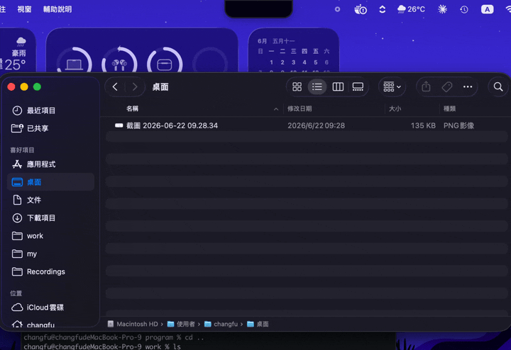

# NotchShelf

把檔案丟到 MacBook 瀏海（notch）下方暫存的小工具，需要時再拖出來。
原生 Swift / AppKit，常駐在選單列，不佔 Dock。

<p align="center">
  
</p>

## 功能

- **拖入暫存**：把檔案拖到瀏海下方，面板會展開，放開即暫存。
- **拖出取用**：滑鼠移到瀏海下方面板會展開，把項目拖到 Finder 或任何 App 即可取出。
- **多選**：在空白處按住拖曳可以框選（像 Finder 的橡皮筋），Shift＋框選會累加；也可以點一下項目選取（再點一下取消）、Shift＋點選連續範圍，或用標題列的「全選」／「移除所選」。拖曳任一已選取的項目會把整組一起拖出。點面板空白處可取消選取。
- **拖到終端機**：cmux、Ghostty、iTerm2、Terminal 這類只認檔案路徑的 App 也收得到。
- **暫存位置**：`~/Library/Application Support/NotchShelf/Stash`（選單可直接打開）。
- **選單列**：展開／收合、打開暫存資料夾、搬移模式開關、清空、結束。

## 行為說明（重要）

- **拖入＝複製**：原始檔案保留不動，只把副本放進暫存。
- **拖出＝搬移（預設）**：把項目從瀏海拖到 Finder/App，檔案送達後就會從暫存資料夾刪除（真正的搬移）。
  拖出使用 `NSFilePromiseProvider`，**只有在目的端確實收到完整檔案後**才刪除暫存副本，
  即使是大型檔案也不會發生複製未完成就被刪除的問題；若目的端沒有接收（例如不支援的 App），暫存檔會保留。
  每個項目右上角有 **×** 可手動移除；丟到「垃圾桶」也會移除。
- **改成複製**：若想拖出後仍保留暫存副本，到選單把「拖出後從暫存移除」關掉即可。
- **拖到只認路徑的 App**：拖出時 pasteboard 同時帶著 file promise 和真實檔案路徑（`public.file-url`），promise 排在前面。
  Finder、Mail 這類支援 promise 的 App 照舊走 promise；終端機、cmux、多數 Electron App 只讀路徑，拿到的是暫存資料夾裡那個檔案的路徑。
  這種情況沒有任何複製發生，所以就算開著搬移模式，暫存檔也會保留（路徑才不會失效）。
  若目的端拿到路徑後自己把檔案搬走（Finder 可能這麼做），暫存區會透過資料夾監看自動更新。
  - cmux 0.64 的預設行為是把拖入的檔案開成預覽／分割面板；放開時按住 **Shift** 才會在終端機貼上路徑。

## 編譯與安裝

需要 Xcode Command Line Tools（已內含 Swift 與 macOS SDK）。

```bash
cd NotchShelf
./build.sh
open /Applications/NotchShelf.app
```

`build.sh` 會：release 編譯 → 組裝 `NotchShelf.app`（含 App 圖示）→ ad-hoc 簽章 → 直接安裝到 `/Applications`。

repo 裡不會留第二份 `.app`——同一台機器上有兩份同名程式，Alfred、Spotlight、登入項目都會各看到兩個。想裝到別的地方就 `INSTALL_DIR=~/Applications ./build.sh`。

App 圖示是程式畫出來的，沒有美術原始檔：`./make-icon.sh` 用 CoreGraphics 直接產生 `Resources/AppIcon.icns`。`.icns` 已經進版控，平常編譯不用跑，要改圖示才重跑。

> 圖示的瀏海是「填深色」而不是「打穿成透明」。試過打穿，圖檔本身沒問題，但 macOS 26 會把輪廓不完整的 App 圖示自動墊到一塊系統預設的淺色底板上，64／128pt 就變成灰白框裡塞一顆縮小的圖示。外輪廓保持完整的超橢圓才不會觸發。

啟動後沒有視窗也沒有 Dock 圖示，瀏海下方會出現一條深色小條（選單列也會有 📥 圖示）。

### 開機自動啟動（選擇性）

系統設定 →「一般」→「登入項目」→ 加入 `NotchShelf.app`。

## 開發

```
Sources/NotchShelf/
  main.swift                 進入點（accessory app）
  AppDelegate.swift          選單列、生命週期
  ShelfStore.swift           暫存資料夾與檔案清單
  NotchWindowController.swift 浮動面板定位、展開／收合
  ShelfRootView.swift        拖入目標、面板內容、選取狀態、hover 偵測
  ShelfItemView.swift        單一項目（icon + 名稱 + × + 選取勾勾），點選／偵測拖曳
  ShelfDragCoordinator.swift 拖出：一次拖多檔、file promise ＋ 檔案路徑備援
```

重新編譯：`./build.sh`
